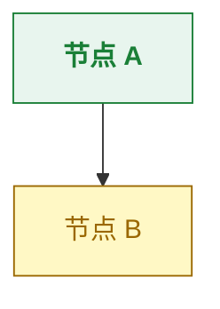

# CDN Stack 详细配置

## 加载顺序（关键）

```html
<head>
  <!-- 1. Tailwind 最早（其他依赖它的类） -->
  <script src="https://cdn.tailwindcss.com"></script>

  <!-- 2. Tailwind config（紧跟 Tailwind，定义自定义 theme） -->
  <script>
    tailwind.config = { theme: { extend: { /* ... */ } } }
  </script>

  <!-- 3. Highlight.js CSS -->
  <link rel="stylesheet" href="https://cdnjs.cloudflare.com/ajax/libs/highlight.js/11.9.0/styles/github.min.css">

  <!-- 4. 自定义 CSS（覆盖 Tailwind 默认值） -->
  <style>
    html { scroll-behavior: smooth; }
    [x-cloak] { display: none !important; }
    /* ... */
  </style>
</head>

<body>
  <!-- 内容 -->

  <!-- 5. 脚本放 body 末尾，按依赖顺序 -->
  <script src="https://cdnjs.cloudflare.com/ajax/libs/highlight.js/11.9.0/highlight.min.js"></script>
  <script src="https://cdn.jsdelivr.net/npm/mermaid@10/dist/mermaid.min.js"></script>
  <script defer src="https://cdn.jsdelivr.net/npm/alpinejs@3.x.x/dist/cdn.min.js"></script>

  <!-- 6. 初始化代码最后 -->
  <script>
    mermaid.initialize({ /* config */ });
    hljs.highlightAll();
    // scroll spy 等
  </script>
</body>
```

**为什么这个顺序**：
- Tailwind 必须最先：其他元素的 class 才能被 JIT 编译
- Tailwind config 紧跟：定义 theme 后才能用 `text-info` `bg-success` 等自定义色
- 自定义 CSS 在 Tailwind 之后：才能覆盖 Tailwind 默认值
- 脚本放末尾：DOM 就绪后再执行
- Alpine 用 `defer`：自动等 DOM 加载完
- Mermaid initialize 必须在 mermaid.min.js 之后

## Tailwind Theme 配置

```javascript
tailwind.config = {
  theme: {
    extend: {
      fontFamily: {
        sans: ['-apple-system','BlinkMacSystemFont','Inter','Segoe UI','PingFang SC','Hiragino Sans GB','Microsoft YaHei','sans-serif'],
        mono: ['JetBrains Mono','SF Mono','Monaco','Consolas','monospace']
      },
      colors: {
        ink: { 900:'#1f2328', 700:'#59636e', 500:'#8c959f', 300:'#d0d7de' },
        line: { DEFAULT:'#d0d7de', soft:'#e8ecf0' },
        info:    { bg:'#ddf4ff', text:'#0969da', border:'#54aeff' },
        success: { bg:'#e8f5ee', text:'#1a7f37', border:'#3fb950' },
        warning: { bg:'#fff8c5', text:'#9a6700', border:'#d4a72c' },
        danger:  { bg:'#ffebe9', text:'#cf222e', border:'#ff8182' }
      },
      boxShadow: {
        'card': '0 1px 3px rgba(31,35,40,0.04), 0 1px 2px rgba(31,35,40,0.06)',
        'card-hover': '0 4px 12px rgba(31,35,40,0.08), 0 2px 4px rgba(31,35,40,0.06)'
      }
    }
  }
}
```

**关键点**：
- 每个状态色三态：`bg`（浅色背景）/ `text`（文字）/ `border`（边框）
- ink 色阶：900（标题）/ 700（次要文字）/ 500（caption）/ 300（边线）
- 字体栈含中文兜底（PingFang SC / Microsoft YaHei）

## Mermaid Initialize 配置

```javascript
mermaid.initialize({
  startOnLoad: true,
  theme: 'base',  // 'base' 最克制，'default' 次之，'dark'/'forest' 别用
  themeVariables: {
    primaryColor: '#ffffff',
    primaryTextColor: '#1f2328',
    primaryBorderColor: '#0969da',
    lineColor: '#59636e',
    secondaryColor: '#fafbfc',
    tertiaryColor: '#ffffff',
    background: '#fafbfc',
    mainBkg: '#ffffff',
    secondBkg: '#fafbfc',
    fontSize: '14px',
    fontFamily: '-apple-system, BlinkMacSystemFont, Inter, Segoe UI, PingFang SC, sans-serif'
  },
  flowchart: { curve: 'basis', htmlLabels: true, padding: 16 },
  sequence: { showSequenceNumbers: false, boxMargin: 8, noteMargin: 8, messageMargin: 35 },
  timeline: { padding: 16 }
});
```

**节点颜色编码**（classDef）：



颜色必须与全局状态色一致，让图表和正文形成视觉统一。

## Highlight.js

```javascript
hljs.highlightAll();
```

CSS 用 GitHub 主题（浅色，对比度好）。代码块标记语言：

```html
<pre><code class="language-python">def hello():
    pass</code></pre>
```

## Alpine.js 常用模式

### Tab 切换

```html
<div x-data="{ tab: 'a' }">
  <button @click="tab='a'" :class="tab==='a' ? 'border-info-text text-info-text' : 'border-transparent text-ink-500'">Tab A</button>
  <button @click="tab='b'" :class="tab==='b' ? 'border-info-text text-info-text' : 'border-transparent text-ink-500'">Tab B</button>

  <div x-show="tab==='a'">内容 A</div>
  <div x-show="tab==='b'" x-cloak>内容 B</div>
</div>
```

**注意**：`x-cloak` 配合 CSS `[x-cloak] { display: none !important; }` 防止初始化前闪烁。

### Tooltip

```html
<span class="relative cursor-help border-b border-dashed border-info-text"
      x-data="{ show: false }"
      @mouseenter="show=true" @mouseleave="show=false">
  术语
  <div x-show="show" x-cloak
       class="absolute bottom-full left-1/2 -translate-x-1/2 mb-1
              bg-gray-900 text-white text-xs px-2 py-1 rounded whitespace-nowrap">
    解释文字
  </div>
</span>
```

## Scroll Spy

```javascript
const links = document.querySelectorAll('.toc-link');
const observer = new IntersectionObserver((entries) => {
  entries.forEach(entry => {
    if (entry.isIntersecting) {
      const id = entry.target.id;
      links.forEach(l => l.classList.remove('active'));
      const active = document.querySelector(`.toc-link[href="#${id}"]`);
      if (active) active.classList.add('active');
    }
  });
}, { rootMargin: '-15% 0px -70% 0px' });

document.querySelectorAll('section[id]').forEach(el => observer.observe(el));
```

`rootMargin: '-15% 0px -70% 0px'` 让"高亮当前章节"的判定更精准（章节顶部进入视口 15%-30% 区域时触发）。

## 防坑

- **Tailwind CDN 不能用于生产**：JIT 编译有延迟，首次加载可能闪烁。生产应用 PostCSS 编译。但 skill 场景（个人/团队文档）CDN 完全 OK。
- **Mermaid 节点 ID 不能有特殊字符**：用英文 ID，节点内容用引号包裹可含中文/emoji
- **Mermaid 中 `<br/>` 换行**：节点内换行用 `<br/>`，不能用 `\n`
- **Alpine `x-cloak` 必须配 CSS**：否则初始化前会闪现所有内容
- **HLJS 默认语言不够**：要识别 bash/json/yaml/python 等，可能需要额外加载语言包
