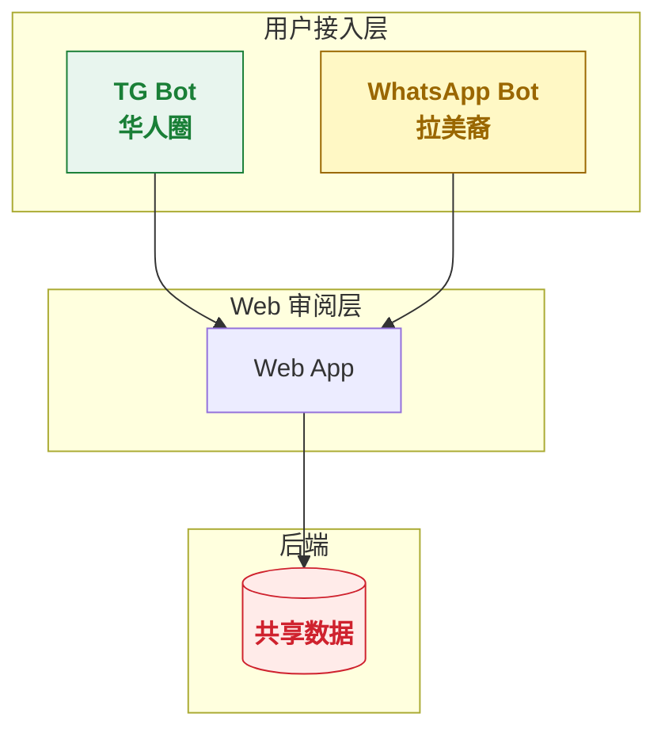
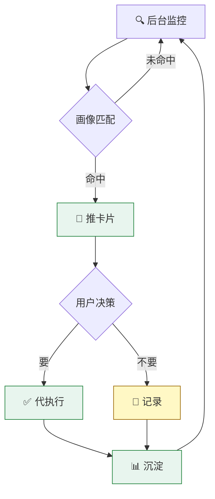
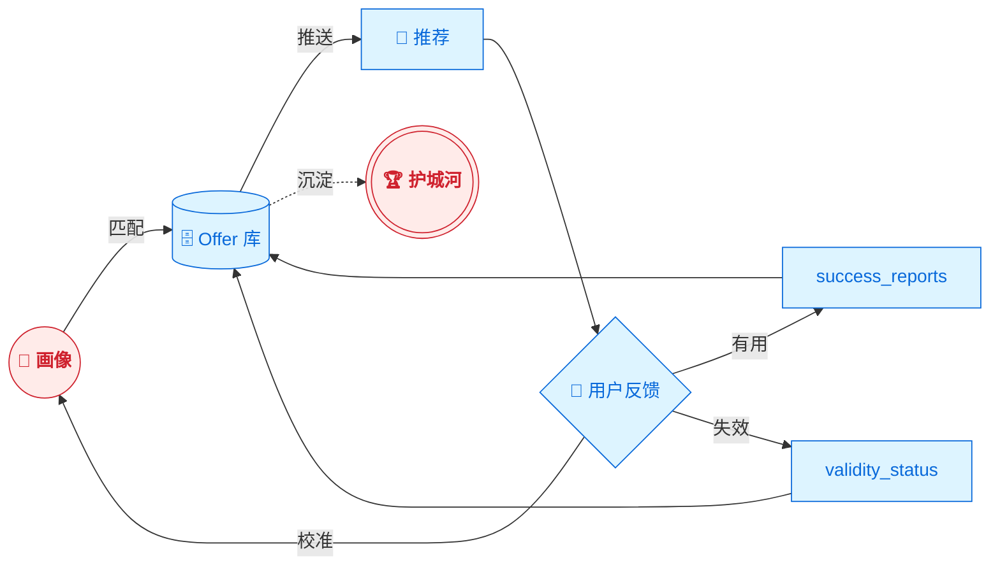
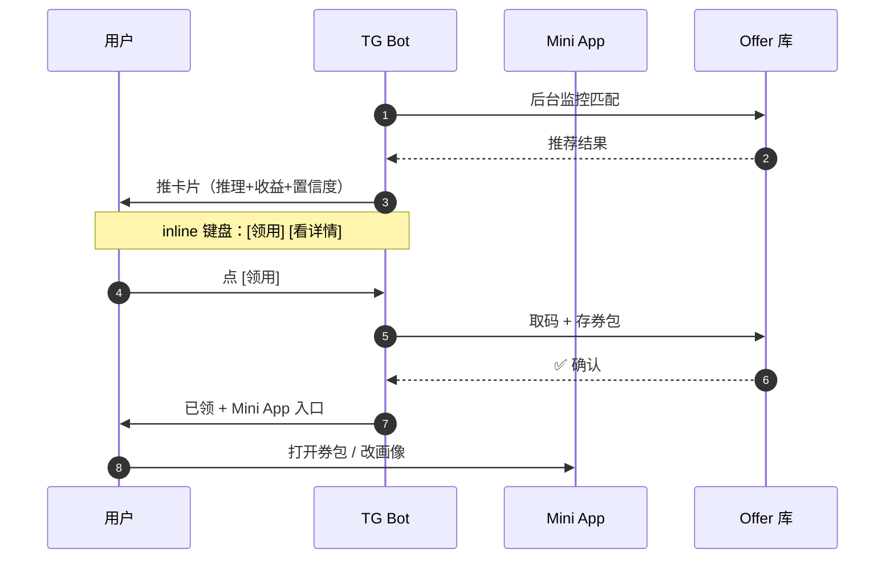
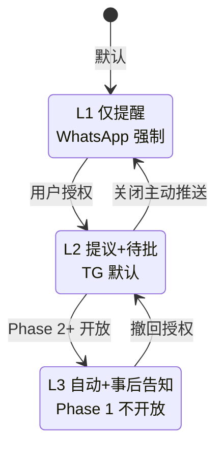
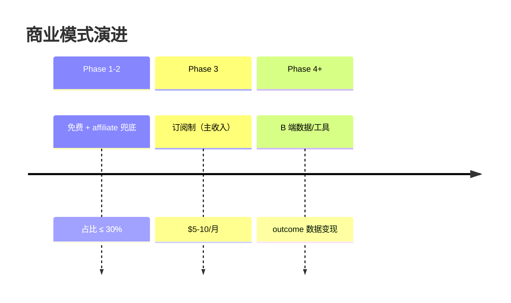

# 可视化模式库（内容 → 图表类型映射）

## 总映射表

| 内容类型 | 表现形式 | 关键场景 |
|---|---|---|
| 系统架构（多层级） | Mermaid graph TB + subgraph + classDef | 双渠道架构、四层分层 |
| 业务流程（含分支） | Mermaid flowchart TD | 用户决策、推送循环 |
| 闭环反馈 | Mermaid flowchart LR + 起点终点连回 | 数据飞轮、护城河循环 |
| 时序交互（多角色） | Mermaid sequenceDiagram + autonumber + Note | API 调用、用户-bot 后端交互 |
| 状态转换 | Mermaid stateDiagram-v2 + note | L1/L2/L3 主动性档位 |
| 阶段演进 | Mermaid timeline | Phase 1/2/3 路径、商业模式演进 |
| 对比关系 | 并排卡片（不同色边框）+ 可选 Venn 图 | 双人群、双方案 |
| 多维层级 | 自定义 SVG 金字塔 / 阶梯 | 留存层次、优先级阶梯 |
| 风险/优先级矩阵 | SVG 2D 矩阵 | 风险评估、 Eisenhower 矩阵 |
| 嵌套分类 | 嵌套卡片网格（无合适图表时） | 文档体系、能力域划分 |
| 长列表对比 | 响应式表格 + 状态色 | 能力矩阵、字段定义 |
| KPI 数字 | 大字号卡片 + tabular-nums | 北极星、规模、占比 |

## Mermaid 模式库

### 1. graph TB（系统架构）

适用：多层级架构、技术栈拓扑



要点：
- 用 subgraph 分层
- 节点内容用引号包裹（支持 `<br/>` 和 emoji）
- classDef 配合全局状态色
- 不同层节点用不同颜色（视觉分组）

### 2. flowchart TD（业务流程）

适用：含决策分支的流程



要点：
- 决策点用 `{}` 菱形
- 分支标签 `|命中|` `|未命中|`
- 用 classDef 色分关键路径 vs 异常路径
- 闭环用虚线 `-.->`

### 3. flowchart LR（闭环反馈）

适用：数据飞轮、护城河循环



要点：
- 圆形节点 `()` 表示实体（用户/数据资产）
- 双圆 `((()))` 表示抽象概念（护城河）
- 数据存储用 `[( )]` 圆柱
- 闭环箭头是核心，必须能看出"循环"

### 4. sequenceDiagram（时序交互）

适用：多角色交互、API 调用链



要点：
- `autonumber` 自动编号步骤
- `Note over X,Y:` 跨参与者注释（关键约束/警告）
- 实线 `->>` 请求，虚线 `-->>` 响应
- 参与者名字简短，alias 用 As

### 5. stateDiagram-v2（状态机）

适用：状态转换、档位机制



要点：
- `[*]` 表示起始/终止
- 状态名后跟 `: 描述` 给状态加注释（支持 `<br/>`）
- 双向转换用 `-->`

### 6. timeline（阶段演进）

适用：时间序列、Phase 演进



要点：
- `section` 分段
- `:` 后是补充说明（同一阶段多行）
- 适合路线图、版本演进

## 自定义 SVG

适用：Mermaid 没有合适表达方式的视觉结构

### 金字塔（层次模型）

```html
<svg viewBox="0 0 800 360" class="w-full">
  <!-- Layer 4: 顶层 -->
  <polygon points="320,40 480,40 460,120 340,120"
           fill="#ffebe9" stroke="#cf222e" stroke-width="2"/>
  <text x="400" y="75" text-anchor="middle" font-size="13"
        font-weight="600" fill="#cf222e">Layer 4 · 顶层</text>

  <!-- 其他层（梯形面积递增） -->
  <!-- 右侧标注 -->
  <line x1="490" y1="80" x2="600" y2="80" stroke="#cf222e"
        stroke-width="1" stroke-dasharray="2,2"/>
  <text x="605" y="83" font-size="10" fill="#cf222e">关键标签</text>

  <!-- 左侧维度箭头 -->
  <text x="80" y="200" font-size="12" fill="#59636e"
        font-weight="600">深度 →</text>
</svg>
```

要点：
- `viewBox` 用响应式
- 用 polygon 画梯形/三角形
- 颜色与全局状态色一致
- 加虚线指引 + 右侧标签解释每层含义

### Venn 图（互补/重叠关系）

```html
<svg viewBox="0 0 200 110" class="w-36">
  <circle cx="70" cy="50" r="38" fill="#1a7f37"
          fill-opacity="0.25" stroke="#1a7f37" stroke-width="1.5"/>
  <circle cx="130" cy="50" r="38" fill="#9a6700"
          fill-opacity="0.25" stroke="#9a6700" stroke-width="1.5"/>
  <text x="45" y="55" font-size="10" fill="#1a7f37" font-weight="600">A</text>
  <text x="130" y="55" font-size="10" fill="#9a6700" font-weight="600">B</text>
  <text x="100" y="105" font-size="9" fill="#59636e"
        text-anchor="middle">重叠关系说明</text>
</svg>
```

适用：双人群互补、双方案差异、能力交集。

### 2D 矩阵（风险/优先级）

```html
<svg viewBox="0 0 600 400">
  <!-- 背景网格 4 象限 -->
  <rect x="50" y="50" width="250" height="150" fill="#e8f5ee"/>
  <rect x="300" y="50" width="250" height="150" fill="#fff8c5"/>
  <rect x="50" y="200" width="250" height="150" fill="#fff8c5"/>
  <rect x="300" y="200" width="250" height="150" fill="#ffebe9"/>

  <!-- 坐标轴标签 -->
  <text x="25" y="50" font-size="11" fill="#59636e">高</text>
  <text x="25" y="350" font-size="11" fill="#59636e">低</text>
  <text x="50" y="380" font-size="11" fill="#59636e">低</text>
  <text x="500" y="380" font-size="11" fill="#59636e">高</text>

  <!-- 风险点 -->
  <circle cx="450" cy="100" r="10" fill="#cf222e"/>
  <text x="465" y="105" font-size="11">风险 1</text>
</svg>
```

适用：风险热度（严重度 × 概率）、Eisenhower 矩阵（重要 × 紧急）、能力评估。

## 嵌套卡片网格（无合适图表时）

适用：层级关系但 Mermaid 表达不够直观（如文档体系位置）

```html
<div class="grid grid-cols-5 gap-3 items-stretch">
  <!-- 上游：4 份 -->
  <div class="col-span-2 card p-4 bg-gray-50">
    <div class="text-[11px] uppercase tracking-wider text-ink-500 font-semibold mb-3">
      ↑ 上游 · 已有文档
    </div>
    <div class="space-y-2.5 text-sm">
      <div class="flex gap-2">
        <span class="font-mono text-xs w-16">概念层</span>
        <span class="text-xs">《概念.md》</span>
      </div>
      <!-- 更多 -->
    </div>
  </div>

  <!-- 当前：突出 -->
  <div class="col-span-1 card border-2 border-info-border bg-info-bg relative">
    <div class="absolute -top-2.5 left-1/2 -translate-x-1/2 bg-info-text text-white
                text-[10px] font-bold px-2 py-0.5 rounded-full tracking-wider">
      📍 YOU ARE HERE
    </div>
    <div class="text-center py-2">
      <div class="text-[11px] uppercase tracking-wider text-info-text font-semibold">
        产品层
      </div>
      <div class="text-sm font-bold text-info-text">本文档</div>
    </div>
  </div>

  <!-- 下游：3 份 -->
  <div class="col-span-2 card p-4 bg-gray-50">
    <!-- 类似上游 -->
  </div>
</div>
```

要点：
- 用 `col-span-N` 控制每列宽度
- 当前位置用 `border-2 border-info-border bg-info-bg` + `YOU ARE HERE` badge 突出
- 上下游用灰色背景（次要）

## 何时不用 Mermaid（避免的陷阱）

- **简单线性步骤** → 用 timeline 组件（HTML/CSS）或带序号的列表，不必 Mermaid
- **2-3 个简单对比** → 直接并排卡片，Mermaid 反而过度
- **嵌套很深（>5 层）的复杂结构** → Mermaid 难看清，用嵌套卡片或拆分多图
- **大量节点（>15）** → 拆分多个小图，否则渲染慢、视觉乱

## Mermaid 防坑

- **节点 ID 用英文**：中文 ID 会报错。中文内容用引号包裹
- **emoji 直接放节点里**：`"📱 TG Bot"` 可用
- **换行用 `<br/>`**：不能用 `\n`
- **`<` `>` 等特殊字符要转义**：或用引号包裹节点内容
- **classDef 必须在 graph 内定义后用 `class` 引用**：顺序不能反
